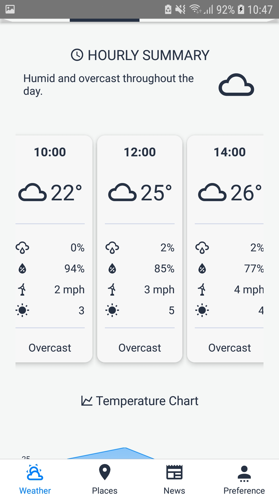
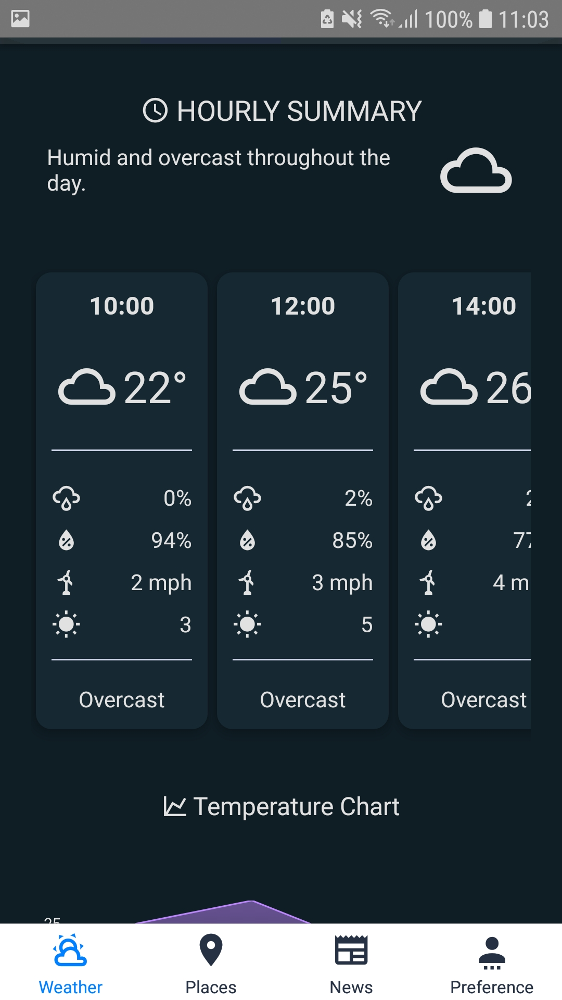
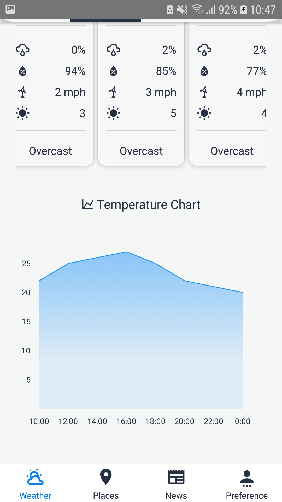
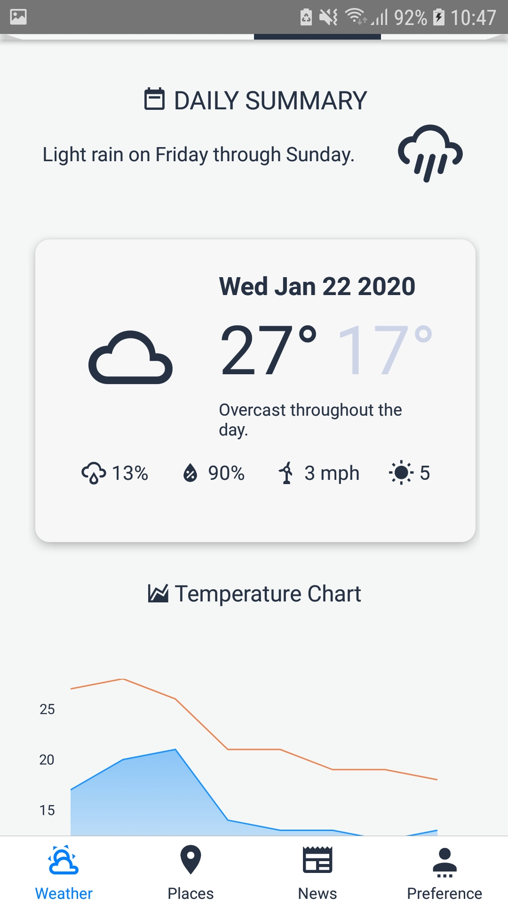
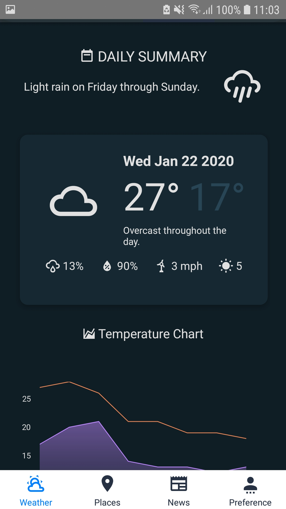
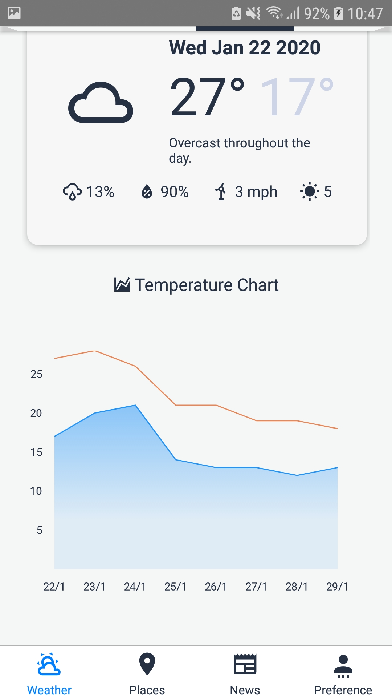
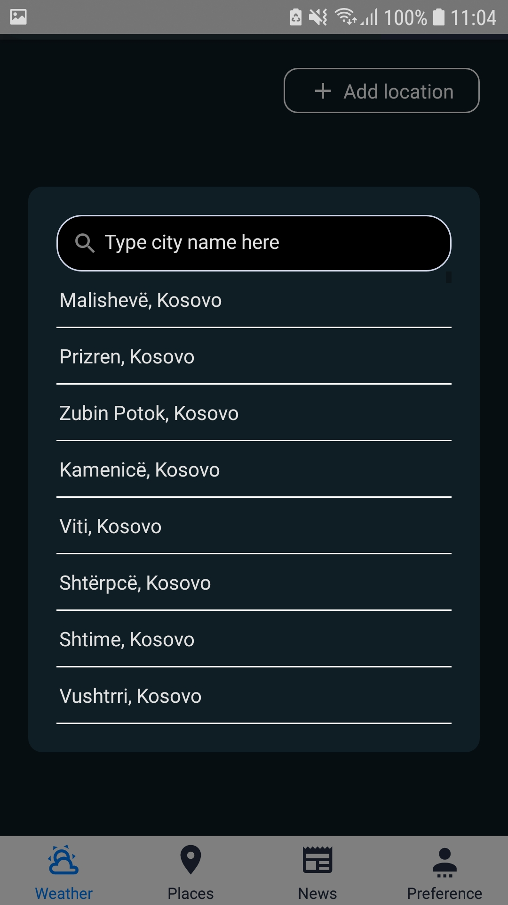
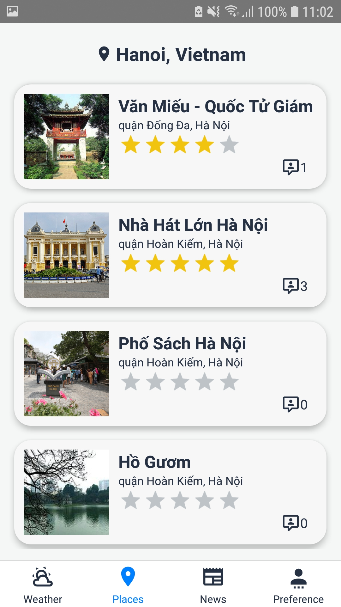
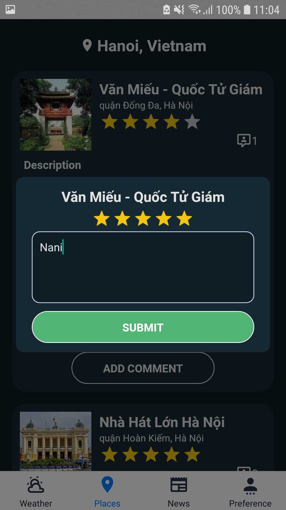
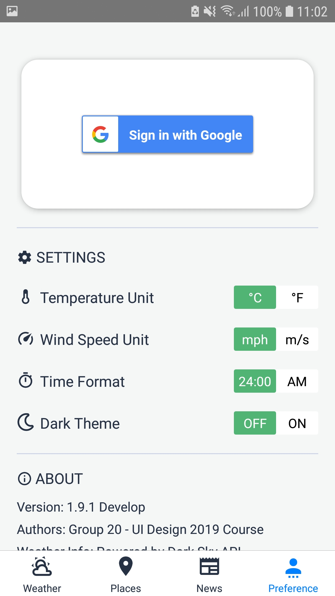

## 1. Giới thiệu
  Ứng dụng dự báo thời tiết cho thiết bị di động.
  Bao gồm các chức năng:
   - Xem thời tiết vị trí hiện tại theo ngày trong tuần và từng giờ.
   - Xem thời tiết theo các thành phố khác.
   - Gợi ý địa điểm vui chơi dựa theo thời tiết, người dùng có thể thực hiện bình luận và đánh giá địa điểm đó.
   > Sử dụng tính năng sign in sẵn có của google trên thiết bị thay cho việc tạo mới tài khoản.
   - Xem tin tức thời tiết từ vov.vn

## 2. Cài đặt 
  - Cài đặt MongoDB, tạo collection `weatherApp` nếu cần, import dữ liệu từ `mongoData/places.json`
  - Clone thư mục về
  ```` git clone https://github.com/huynguyend191/wtforecasterX ````
  - Cài đặt thư viện cho từng folder
  ````
  cd weatherForecastServer
  npm install
  cd WtForecaster
  npm install
  ````
  - Trong thư mục WtForecaster, vào thư mục utils, sửa baseURL với ipv4 của mạng đang sử dụng (có thể xem bằng cách vào cmd, gõ `ipconfig /all`)
  ````
  const baseURL = 'http://<ipv4>:3000';
  ````

## 3. Sử dụng
  Khởi động server
  ````
  cd weatherForecastServer
  npm install
  ````
  Chạy ứng dụng trên android: Kết nối thiết bị thật đã bật debug hoặc máy giả lập
  ````
  cd WtForecaster
  react-native run-android
  ````

## 4. Screenshot
Light Theme          |  Dark Theme
:-------------------------:|:-------------------------:
  |   
  |   
  |   
  |   
  |   
  |   
  |   
  |   
  |   
 |   
 |   
 |   
 |   
 |   


